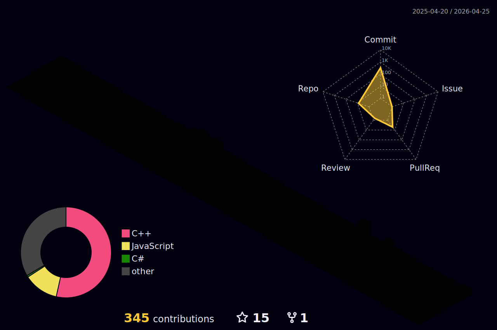

<div align="center">
  
</div>

```bash
paulus-seo@hyundai-wia:~$ cat ./profile/bio.txt

"As a Systems Engineer within the Robot Software Team at Hyundai-WIA,
 I specialize in the end-to-end development of autonomous robotic systems."

[Key Interests]
* System Architecture: Building robust & scalable solutions
* Developer Experience: "Great environment makes great product"
```

<br>

<table align="center">
  <tr>
    <td width="50%" valign="top" align="center">
      <h3>🛠️ Tech Stack</h3>
      
      
      
      <br>
      
      
      
      <br>
      
      
      
    </td>
    <td width="50%" valign="top" align="center">
      <h3>📫 Connect</h3>
      <br><br>
      <a href="https://www.linkedin.com/in/paulusseo/">
        
      </a>
      <a href="mailto:m9472757c@gmail.com">
        
      </a>
    </td>
  </tr>
  <tr>
    <td colspan="2" align="center">
      
    </td>
  </tr>
</table>
